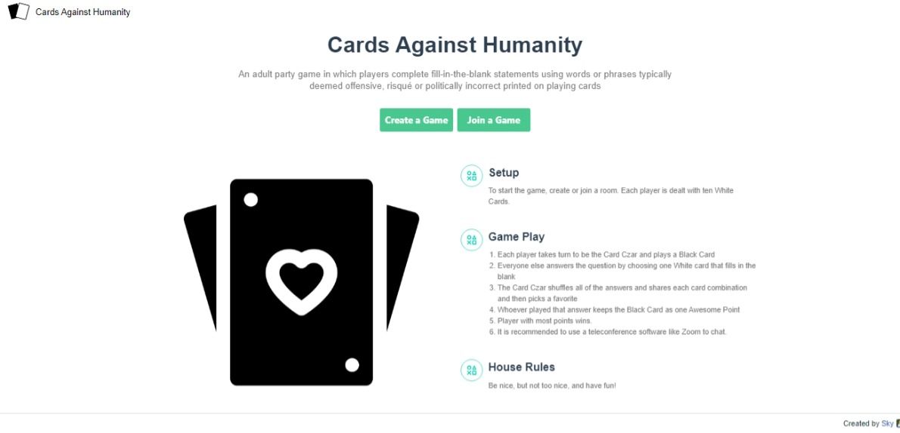
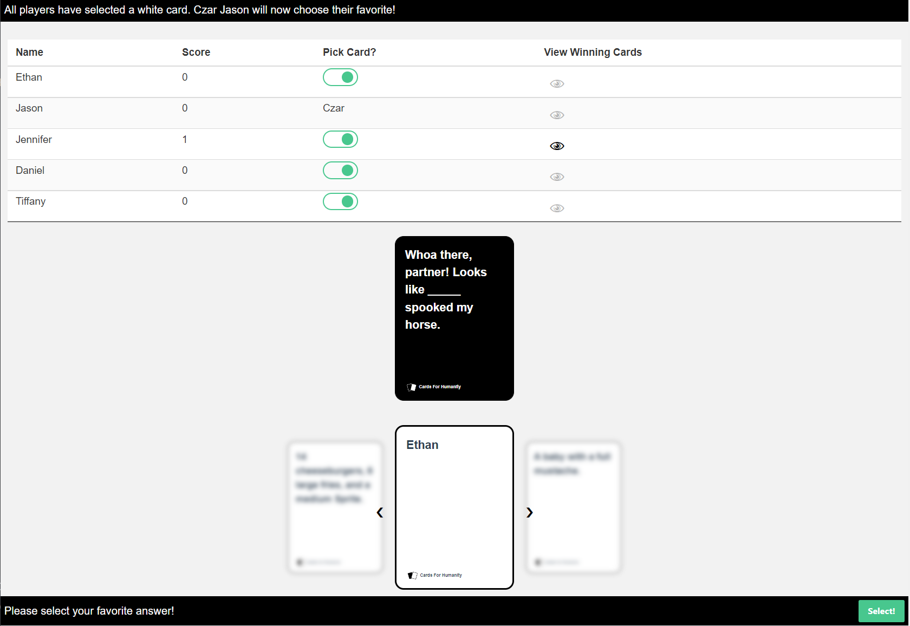

# Cards For Humanity ❤️

> Traditional [Cards Against Humanity](https://en.wikipedia.org/wiki/Cards_Against_Humanity) game moved to online experience! App supports a kid friendly version, hence Cards For Humanity






## Objectives
1. Each player takes turn to be the Card Czar and plays a Black Card
1. Everyone else answers the question by choosing one White card that fills in the blank
1. The Card Czar shuffles all of the answers and shares each card combination and then picks a favorite
1. Whoever played that answer keeps the Black Card as one Awesome Point
1. Player with most points wins.
1. It is recommended to use a teleconference software like Zoom to chat.

## How to play
1. Visit game's **[website](https://etuong.github.io/cards-for-humanity/)** 🔗
2. Create a new room or join an existing one
3. Invite your friends and give them the password to the room. You need at least three players to play.
4. Enjoy 😊

## Development
- client folder contains frontend related artifacts
  - ```yarn serve``` runs the application
  - ```yarn build``` builds the static resources
  - ```yarn deploy``` deploys the static resources to your Github page
- server folder contains backend related files
  - ```yarn start``` kicks off the server

## Deployment
- Push server
  - If you host the socket.io server with Heroku, follow the following instruction
  - Heroku Setup
      ```
      npm install -g heroku
      heroku login
      heroku git:remote -a your-app
      git subtree push --prefix server heroku master
      ```
  - FYI since Heroku is no longer free, I would suggest to use Render (https://render.com/)
  
- Push client
  - Use your preference to host your client app. I chose Github Page for its simplicity.
  - Run ```yarn build``` and then ```yarn deploy```
  - Make sure main.js connects to your server (and not localhost)

### Technologies 🔧
+ [Vue.js](https://vuejs.org/)
+ [Socket.io](https://socket.io/)
+ Client is built, deployed, and hosted on Github Pages using Github Actions. 
+ Server is built and deployed on Render.

### API
Card texts are downloaded and parsed from [here](https://crhallberg.com/cah/) 

#### License ⚖️
[MIT](https://en.wikipedia.org/wiki/MIT_License)
